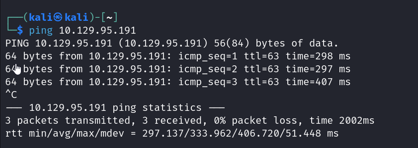
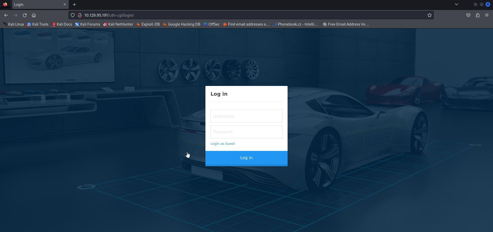
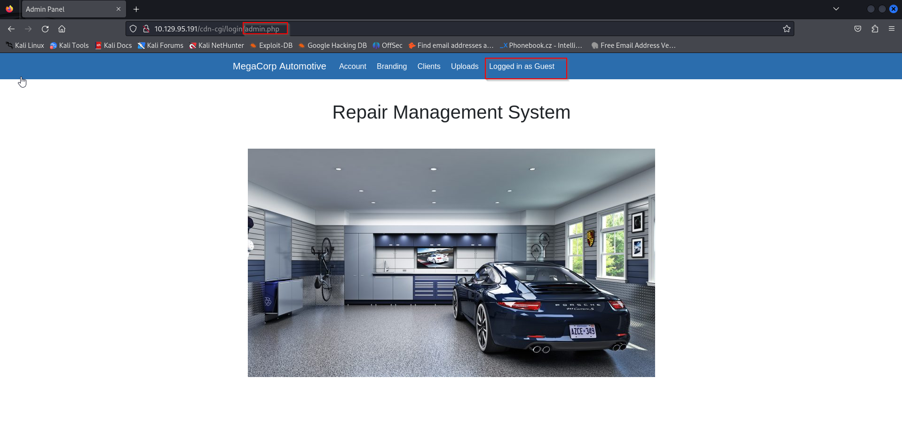
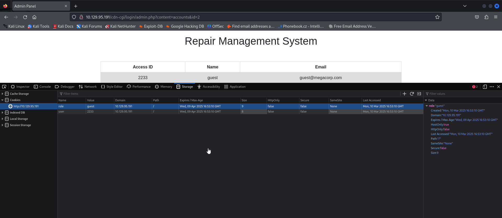
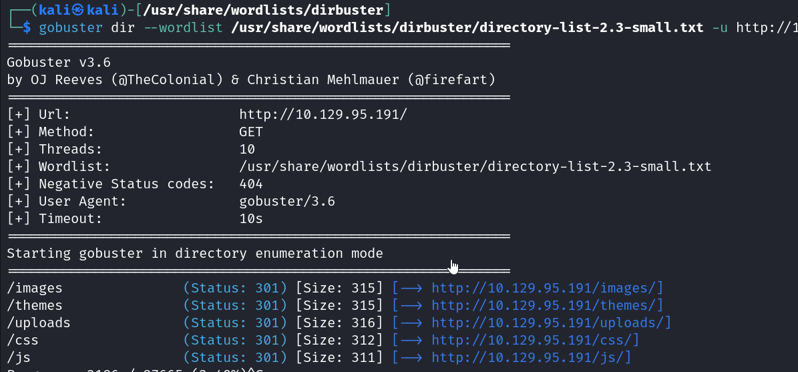
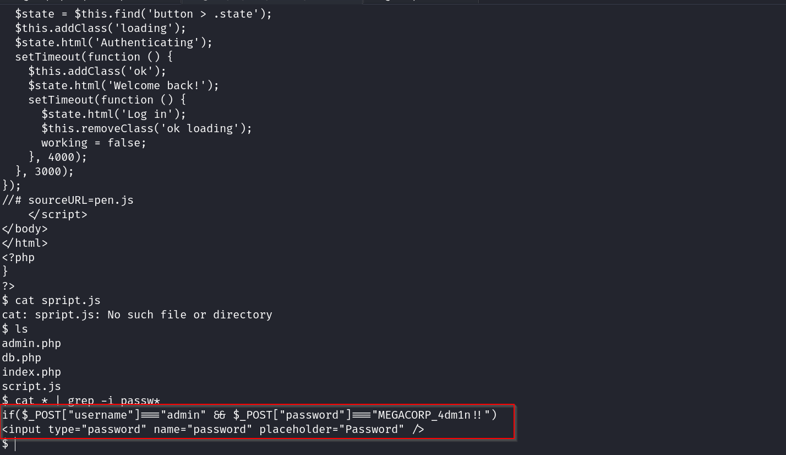
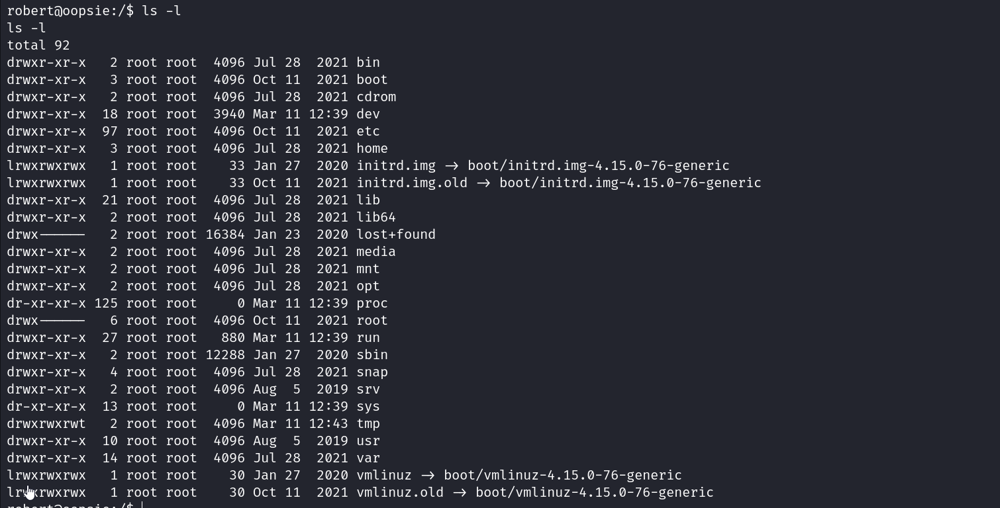
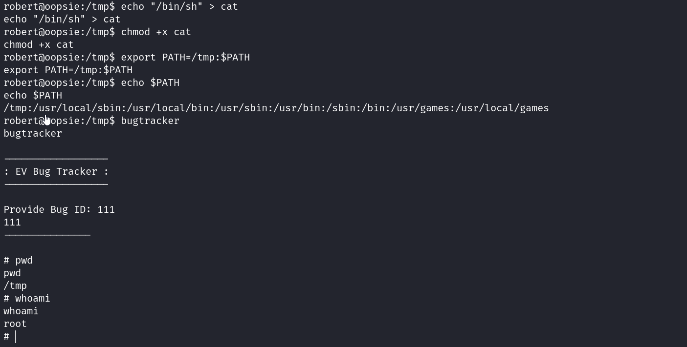
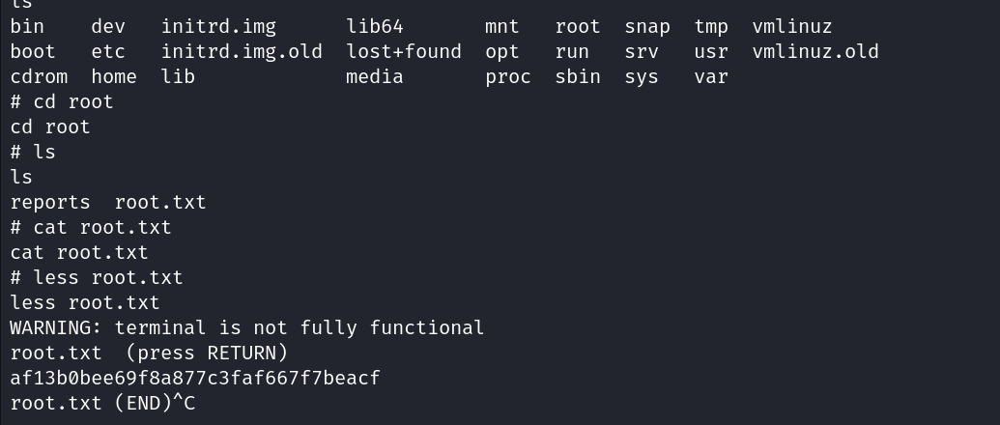

This is the oopsie challenge from starting point tier 2. It's difficulty is also very easy as all the others.

First we connect using openVPN and use ifconfig to confirm the same.
Now we need to start our target machine. Let's check if the machine is up and running too.

Our machine is up and running so let's continue on with the tasks.

task1:
A proxy would be a server that acts as an intermediary between the user's device and net intercepting all web requests and responses before they reach the intended destination.
Answer is "proxy".

task2:
Now to find that we open BurpSuite and then open the link in our browser. When we are led to the webpage we see Burp list out the discovered URL's in the Dashboard and Site map section. There we find our login page URL.

When we visit this login URL we see this..

task3:
Web apps use cookies to keep track of user logged in. So if access to upload page depends on that cookie we can modify the cookie in the browser to gain access.
The answer to this task is "cookie"

task4:
If we click on log in as guest we see this..

We can see that the upper ribbon has a "logged in as guest" confirming we've logged in as guest. 
Now if we go to the accounts section in the ribbon and navigate to the storage section through inspect we see that our URL is a bit different and it specifies ID.

Let's try changing that ID number. Since it's 2 for guest, i would assume it would be 1 for something else.
Trying value 1..

We've succesfully got the access ID of admin user.
access ID is-> 34322

task5:
Now since we have the access ID we can modify the cookie's as such...

and thus we get to the uploads page.

Using gobuster in directory enumeration mode we can find the directories in the server.

here we can see that there is an "uploads" folder which should be the one which contains the files we are uploading.

We will establish a reverse shell connection by uploading php reverse shell.
We modify the port and ip and also start a netcat listener.
After uploading the file through our uploads we enter the file location url and press enter.

we will now have our reverse shell..

task6:
On going throught the folder we get to a login folder in var/www/html
in that if we search for passw using grep we can try to find matching lines with password in it. And we do findd it.

if we navigate to the /etc/ folder we see a passwd file...
on opening that

we can find a user called robert at the bottom. So we now try to login as robert..
When we try to enter the password with the one we found earlier however, it registers as a failure..

while searching for the password i stumbled upon a robert folder which had the user.txt (user flag)

flag-> f2c74ee8db7983851ab2a96a44eb7981

We find our password in the db.php file in the login folder..

On using that password we are able to succesfully enter...

therefore the password was in file db.php

task7:
Let's try to see the information on user robert using 'id' command.

From this we can see that user Robert belongs to 2 groups... Robert and bugtracker.
Now to find the files owned by bugtracker group we use "find"

Therefore we can find a file named bugtrakcer in /usr/bin.

task8:
I tried finding information about the file bugtracker.

On seeing i could execute it, i also went ahead and did that and got some binary package hint for a value i gave.
On giving another value i got...

We can see that the output returned is the command it tried to execute which was the cat command. It tried to execute that command as "root".

task9:
The full form of SUID is "set owner user id".
This permission in linux allows a file to be executed with the permissions of the file's owner. Regardless of the current user.

task10:
We know that the cat command that is used by bugtracker does not specify the file path fully. We can create a fake cat command to execute instead of the normal cat and then include that in the PATH variable so that our fake cat command (which executes a shell as root) is called by bug tracker.
Therefore cat is the executable being called in an insecure manner.

The user flag I had found before.

For the root flag we got to enter as root.
First we check folder's where it's possible to write.

tmp is the only one where it is possible to do so.
Navigate to tmp and then write a cat file with bash "/bin/sh" (to run the shell)
After creating a file cat we give it executable permissions by -> chmod +x /tmp/cat
We also add the path to the PATH variable so that the tmp folder is searched first and our fake cat file is executed.
On execution we can see that we are able to launch a shell as root.

Now as usual the root flag should be in the root folder. So we navigate there. The cat command won't work so we use the less command instead.

